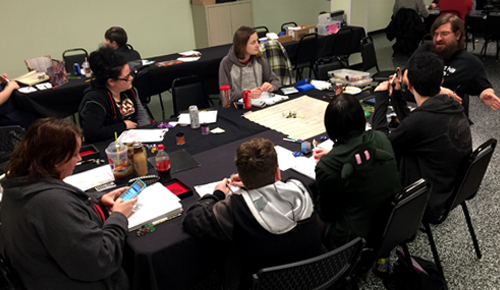

# D&D Adventurers League at Pandemonium Games and Hobbies

Pandemonium Games is located at 6033 Middlebelt Rd, Garden City, MI 48135

<iframe src="https://www.google.com/maps/embed?pb=!1m14!1m12!1m3!1d1474.8037090071111!2d-83.33205666913427!3d42.32957145147724!2m3!1f0!2f0!3f0!3m2!1i1024!2i768!4f13.1!5e0!3m2!1sen!2sus!4v1686367147581!5m2!1sen!2sus" width="600" height="200" style="border:0;" allowfullscreen="" loading="lazy" referrerpolicy="no-referrer-when-downgrade"></iframe>

We are a community of Dungeons and Dragons players that gather both online and at the game store 
[Pandemonium's Webpage] in Garden City, Michigan.

We are currently playing online only, but we will be resuming in-person play soon.

We play every Wednesday night from 7pm until roughly 9pm
and Saturdays from 2pm until roughly 6pm. If you wish to join one of our games, sign up on [Warhorn]. 

Join our [Discord server] to get more information about us

* Our [Warhorn], to sign up for our games:
* Our [Discord server], to chat with folks and participate in online games
* Our [Facebook group]
* [Pandemonium's Webpage]
* [Pandemonium's Discord Server]
* [Pandemonium's Facebook page]

This site is dedicated to the memory of Robert "Joey" Ditsch.

[Warhorn]: https://warhorn.net/events/pandodnd
[Discord server]: https://discord.gg/dbB5RYH5P7
[Pandemonium's Webpage]: https://pandogames.com/
[Pandemonium's Discord Server]: https://discord.gg/Hy2cTGN2fp
[Facebook group]: https://www.facebook.com/groups/PandoDnD
[Pandemonium's Facebook page]:https://www.facebook.com/PandoGames
